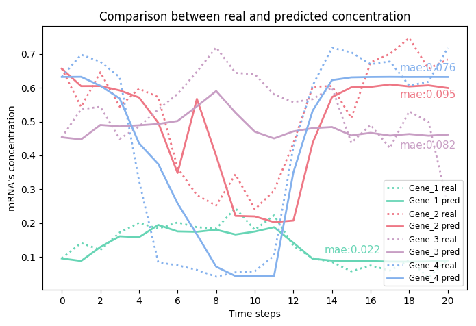

# Neural Gene Network Constructor: A Neural Based Model for Reconstructing Gene Regulatory Network

This repository will contain the official PyTorch implementation of:
<br>

**Neural Gene Network Constructor: A Neural Based Model for Reconstructing Gene Regulatory Network**<br>
Zhang Zhang</span>†, Lifei Wang†, Shuo Wang, Ruyi Tao, Jingshu Xiao, Muyun Mou, Jun Cai*, Jiang Zhang*<sup>\*</sup>(<sup>\*</sup>: Corresponding author) <br>
[https://www.biorxiv.org/content/10.1101/842369v1](https://www.biorxiv.org/content/10.1101/842369v1)<br>



<br>

### Abstract: 

Reconstructing gene regulatory networks (GRNs) and inferring the gene dynamics are impor- tant to understand the behavior and the fate of the normal and abnormal cells. Gene regulatory networks could be reconstructed by experimental methods or from gene expression data. Recent advances in Single Cell RNA sequencing technology and the computational method to reconstruct trajectory have generated huge scRNA-seq data tagged with additional time labels. Here, we present a deep learning model “Neural Gene Network Constructor” (NGNC), for inferring gene regulatory network and reconstructing the gene dynamics simultaneously from time series gene expression data. NGNC is a model-free heterogenous model, which can reconstruct any network structure and non-linear dynamics. It consists of two parts: a network generator which incorporating gumbel softmax technique to generate candidate network structure, and a dynamics learner which adopting multiple feedforward neural networks to predict the dynamics. We compare our model with other well-known frameworks on the data set generated by GeneNetWeaver, and achieve the state of the arts results both on network reconstruction and dynamics learning.

### Requirements

- Python 3.6
- Pytorch 0.4

### Data Generation
To generate experimental data, you need to use the software GeneNetWeaver with default parameters.

### Run Experiment
You can run the experiment by simply running the file train.py
```
python train.py
```


### Cite
If you use this code in your own work, please cite our paper:
```
@article {Zhang842369,
	author = {Zhang, Zhang and Wang, Lifei and Wang, Shuo and Tao, Ruyi and Xiao, Jingshu and Mou, Muyun and Cai, Jun and Zhang, Jiang},
	title = {Neural Gene Network Constructor: A Neural Based Model for Reconstructing Gene Regulatory Network},
	elocation-id = {842369},
	year = {2019},
	doi = {10.1101/842369},
	publisher = {Cold Spring Harbor Laboratory},
	abstract = {Reconstructing gene regulatory networks (GRNs) and inferring the gene dynamics are important to understand the behavior and the fate of the normal and abnormal cells. Gene regulatory networks could be reconstructed by experimental methods or from gene expression data. Recent advances in Single Cell RNA sequencing technology and the computational method to reconstruct trajectory have generated huge scRNA-seq data tagged with additional time labels. Here, we present a deep learning model {\textquotedblleft}Neural Gene Network Constructor{\textquotedblright} (NGNC), for inferring gene regulatory network and reconstructing the gene dynamics simultaneously from time series gene expression data. NGNC is a model-free heterogenous model, which can reconstruct any network structure and non-linear dynamics. It consists of two parts: a network generator which incorporating gumbel softmax technique to generate candidate network structure, and a dynamics learner which adopting multiple feedforward neural networks to predict the dynamics. We compare our model with other well-known frameworks on the data set generated by GeneNetWeaver, and achieve the state of the arts results both on network reconstruction and dynamics learning.},
	URL = {https://www.biorxiv.org/content/early/2019/11/14/842369},
	eprint = {https://www.biorxiv.org/content/early/2019/11/14/842369.full.pdf},
	journal = {bioRxiv}
}

```

